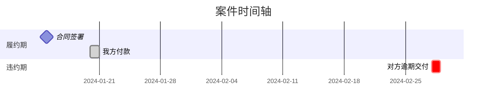

# Legal Litigation Viz — 诉讼可视化专家

> 本 skill 负责将法律文书和案情概要转换为**专业诉讼时间轴图谱**，支持 A4 打印提交法庭或展示客户。
> 与 `litigation-analyst`（案件流程管理）和 `legal-document-generator`（文书生成）互补协作。

---

## 一、定位与边界

|          | litigation-analyst | legal-document-generator | **legal-litigation-viz（本skill）**    |
| -------- | ------------------ | ------------------------ | ----------------------------------- |
| **职责**   | 案件材料管理与归档            | 文书内容生成与格式规范              | **时间轴可视化 + A4打印输出**                 |
| **调用时机** | 案件收料、建档、归档               | 起草文书                     | 需要梳理案件时间线/制作大事记/庭审展示时               |
| **输出**   | 案件档案、材料清单          | 合同/起诉状等终稿                | **HTML时间轴 / Mermaid甘特图 / ASCII时间轴** |

---

## 二、工作流三步法

```
① 事实萃取 → 从法律文书中提取关键法律事实节点
    ↓
② 视觉呈现 → 生成可视化时间轴（推荐 HTML 格式）
    ↓
③ 明细输出 → 附带事件明细表 + 综合分析
```

### 第一步：事实萃取

**必须提取的事件类型：**
- 📄 合同签署/协议达成
- 💰 付款/收款行为
- 📦 交货/提供服务
- ⚠️ 违约事实/瑕疵交付
- 📢 催告/通知/函件
- 💬 协商/谈判
- ⚖️ 起诉/应诉/庭审
- 📋 判决/裁决
- 🔄 上诉/再审

**事实归类规则：**
- 我方行为 → 时间轴上方标注
- 对方行为 → 时间轴下方标注
- 争议焦点 → 🔴 或 ⭐ 特殊标记

### 第二步：视觉呈现（三种格式）

#### 格式 A：Mermaid 甘特图（电子展示用）



→ 详细模式参考：`references/mermaid-patterns.md`

#### 案件信息建档 Mermaid 四图

以下四图是 `03_案件信息.md` 的标配内容，由 litigation-analyst 调度本 skill 生成：

1. **案件大事记时间线** (timeline) — 将全部关键事件按时间排列
2. **法律关系图** (graph TD) — 当事人之间的法律关系拓扑
3. **诉讼流程图** (flowchart LR) — 标注当前所处节点
4. **诉讼时效甘特图** (gantt) — 履约→违约→催告→起诉→开庭→判决各阶段

缺失信息以 `⚠️ 待补充` 标注。

#### 格式 B：HTML 时间轴（⭐ 推荐，支持 A4 打印）

创建完整 HTML 文件，含时间轴 + 明细表 + 综合分析三页布局。

→ 打印模板参考：`references/html-template.md`

#### 格式 C：ASCII 时间轴（备用，嵌入 Markdown 用）

```
        我方行为              时间轴               对方行为
─────────────────────────────────────────────────────
2024-01-15  [📄] 签署《买卖合同》                ←────────────
2024-01-20  [💰] 支付首期款 50万元               ←────────────
2024-02-28                                    ───────────→ [⚠️] 逾期交付
2024-03-05  [📢] 发送催告函                     ←────────────
2024-06-10  [⚖️] 向法院起诉                     ←────────────
```

### 第三步：结构化输出（A4 三页布局）

| 页面 | 内容 | 要点 |
|------|------|------|
| **第1页** | 时间轴图谱 | 标题+基本信息+完整事件轴，不跨页 |
| **第2页** | 事件明细表 | 序号/时间/事件/证据/法律意义/主体 |
| **第3页** | 综合分析 | 争议焦点+证据链+程序结果+总结 |

**打印规范：**
- A4 纵向，边距 1.2cm
- 标题 18pt，正文 10-11pt，表格内容 9-10pt
- 每页底部标注"第 X 页 / 共 3 页"

**色彩编码：**

| 法律阶段 | 推荐颜色 | HEX |
|---------|---------|-----|
| 履约期 | 天蓝 | #87CEEB |
| 违约期 | 柔和珊瑚红 | #FF7F50 |
| 协商期 | 淡黄 | #FFFFE0 |
| 诉讼期 | 淡紫 | #DDA0DD |
| 复审期 | 金色 | #FFD700 |

→ 完整图标系统参考：`references/icon-system.md`

---

## 三、输入材料处理要点

| 材料类型 | 提取重点 |
|---------|---------|
| 起诉状/答辩状 | 诉讼请求、事实理由中的时间节点、举证责任分配 |
| 证据清单 | 关联证据页码到具体事件、标注关键证据 |
| 合同文书 | 签署时间/地点/主体、履约期限、违约条款时间条件 |
| 往来函件 | 发送/接收时间、函件性质、法律效力（时效中断等） |
| 判决书/裁定书 | 事实认定时间节点、法院对关键时间的认定、各审级结果 |

**信息不完整的处理方式：**
- 时间不明 → 标注"约XX年XX月"或"上/中/下旬"
- 主体不清 → 备注栏说明
- 证据缺失 → 标注"待补充"
- 争议事实 → 双方主张分别列出

---

## 四、质量检查清单

### 内容完整性
- [ ] 所有关键事实节点已提取
- [ ] 时间精度达标（精确到日或标注模糊度）
- [ ] 图标使用正确
- [ ] 色彩编码符合规范
- [ ] 争议焦点已明确标注

### 表格完整性
- [ ] 事件明细表信息完整（6列）
- [ ] 法律阶段划分清晰
- [ ] 证据链列出所有关键证据

### 打印布局
- [ ] 三页各自完整，不跨页
- [ ] 每页有页码
- [ ] 字号 ≥ 9pt
- [ ] 边距 1.2cm

### 视觉效果
- [ ] 色彩柔和和专业
- [ ] 黑白打印可读
- [ ] 标题不超过两行

---

## 五、本地化适配规则

1. **默认中文输出** — 所有图表标签、注释均为简体中文
2. **与 litigation-analyst 协作**：
   - 从案件文件夹读取案情文件作为输入源
   - 输出存入案件的 `03_案件信息.md` 中
   - 遵循后者的文件夹结构和命名规范
3. **用户偏好 Mermaid 图** — 在 Markdown 文档中优先用 Mermaid 格式；需打印交付时切换为 HTML 格式
4. **模板为起点** — 根据具体案情调整阶段划分和颜色方案
