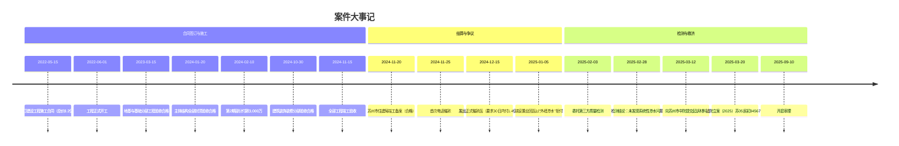
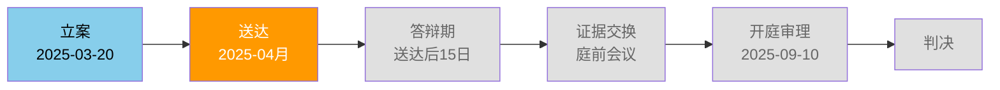
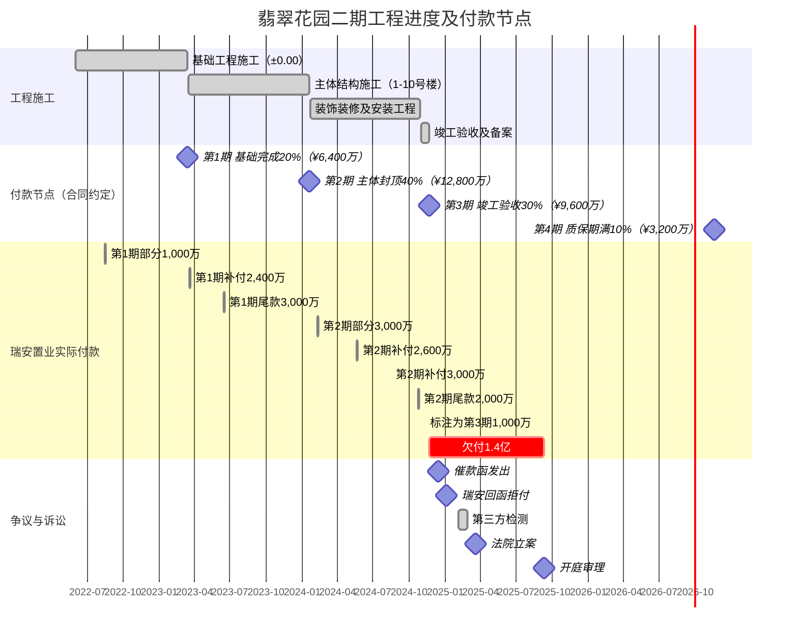
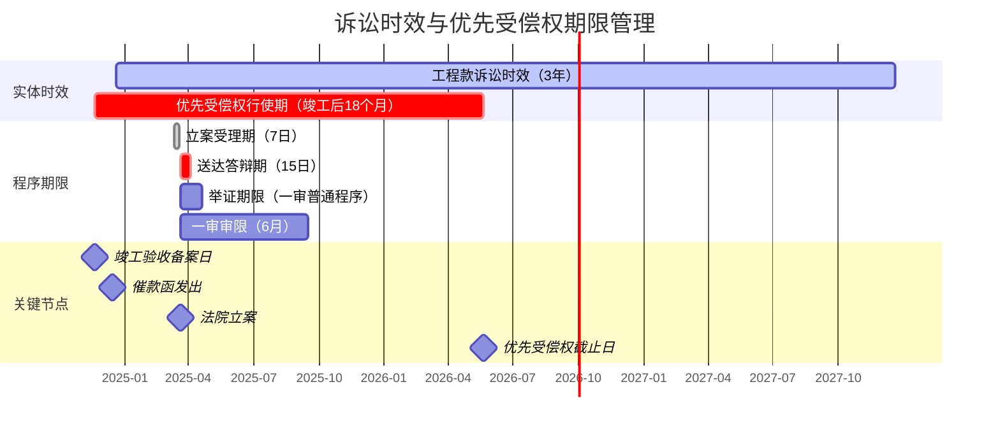

# 案件信息

> 编制日期：2025年5月5日 | 持续更新中

---

## 一、基本信息

| 项目 | 内容 |
|------|------|
| 案号 | （2025）苏05民初34567号 |
| 案件名称 | 中联建设工程有限公司诉苏州瑞安置业有限公司建设工程施工合同纠纷 |
| 案由 | 建设工程施工合同纠纷 |
| 当前诉讼阶段 | 一审 |
| 承办法院 | 苏州市中级人民法院 |
| 承办法官 | 王国栋 |
| 法官联系方式 | 0512-68552888 |
| 书记员 | ⚠️ 待补充 |
| 开庭时间 | 2025年9月10日 上午9:00 |
| 立案时间 | 2025年3月20日 |
| 我方代理律师 | ⚠️ 待补充 |

---

## 二、当事人信息

| 诉讼地位 | 姓名/名称 | 身份证号/统一社会信用代码 | 住所/注册地 | 法定代表人/负责人 | 联系方式 | 代理律师 |
| ---- | ---------- | ------------------ | -------------------- | --------- | ------ | ------ |
| 原告 | 中联建设工程有限公司 | 91320500MA00HIJK456 | 苏州工业园区苏虹中路398号中联大厦 | 赵国栋 | ⚠️ 待补充 | ⚠️ 待补充 |
| 被告 | 苏州瑞安置业有限公司 | 91320500MA00LMN789 | 苏州高新区狮山路88号瑞安大厦18层 | 陈瑞安 | ⚠️ 待补充 | ⚠️ 待补充 |
| 第三人 | — | — | — | — | — | — |

---

## 三、工作时间节点

| 序号 | 事项 | 截止日期 | 负责人 | 状态 | 备注 |
| --- | ------ | ---------- | ----- | ------ | --- |
| 1 | 发函催款 | 2024-12-15 | 赵国栋 | ✅ 已完成 | EMS签收2024-12-17 |
| 2 | 委托检测 | 2025-02-03 | 周建国 | ✅ 已完成 | 检测报告2025-02-28出具 |
| 3 | 立案 | 2025-03-20 | 代理律师 | ✅ 已完成 | 案号（2025）苏05民初34567号，已缴费 |
| 4 | 送达被告 | — | 法院 | 🔄 进行中 | 等待法院送达反馈 |
| 5 | 申请财产保全 | 2025-04-10（建议） | 代理律师 | ⚠️ 需尽快 | 保全翡翠花园二期未售房产或瑞安置业银行账户 |
| 6 | 证据交换 | 2025-08月（预计） | 代理律师 | ⬜ 待办 | 提前准备证据原件 |
| 7 | 庭前会议 | 开庭前15日 | 代理律师 | ⬜ 待办 | — |
| 8 | 补充证据材料 | 开庭前7日 | 代理律师 | ⬜ 待办 | — |
| 9 | 庭审准备 | 2025-09-03 | 代理律师 | ⬜ 待办 | — |

---

## 四、案件可视化图表

### 4.1 案件时间线大事记



### 4.2 法律关系图

```mermaid
graph TD
    A[中联建设工程有限公司<br/>施工方/原告<br/>建筑工程施工总承包特级] -- "建设工程施工合同<br/>ZL-RA-2022-0515<br/>承建翡翠花园二期1-10号楼" --> B[苏州瑞安置业有限公司<br/>发包方/被告<br/>开发商]
    A -- "约定工程所在地法院管辖" --> C[苏州市中级人民法院<br/>（2025）苏05民初34567号]
    B -- "尚欠工程款¥1.4亿未支付" --> A
    B -- "回复函：以"外墙渗水"为由拒付（2025-01-05）" --> A
    D[苏州市建设工程质量检测中心<br/>CMA认证] -- "检测报告：未发现系统性渗水问题<br/>（2025-02-28）" --> A
    E[苏州市住建局] -- "竣工验收备案表<br/>工程质量合格<br/>（2024-11-20）" --> A
    A -- "请求确认建设工程价款优先受偿权" --> F[翡翠花园二期1-10号楼<br/>在建/已竣工工程]
    B -- "欠款1.4亿" --> G[逾期付款违约金<br/>每日0.03%]
```

### 4.3 诉讼流程图及当前节点



> 🔶 橙色高亮：送达阶段（当前所处节点，等待法院向被告送达起诉状副本）

### 4.4 工程进度甘特图



### 4.5 诉讼时效与优先受偿权期限图



---

## ⚠️ 信息空缺提示

| 缺失字段 | 影响 | 建议 |
|----------|------|------|
| 书记员 | 无法确定庭审记录人员 | 等待传票后补充 |
| 被告代理律师 | 无法预判被告答辩策略及论据 | 答辩状送达后补充 |
| 我方代理律师联系方式 | 纯属遗漏 | 请补充 |
| 被告联系方式 | 财产保全时需要 | 尽快获取 |
| 财产保全申请材料 | 🔴 紧急：可能直接影响判决执行效果 | **建议立即准备并提交** |
| 工程款支付银行流水原件 | 证据链中的重要环节，证明付款事实 | 向银行申请调取 |
| 发票开具记录 | 证明已履行开票义务 | 向税务部门调取 |
| 施工过程中的签证变更文件 | 如被告以工程量变更为由抗辩，可作为反证 | 整理存档 |
| 瑞安置业提供的渗水证据 | 需分析被告具体证据以便有效反驳 | 等待证据交换 |
