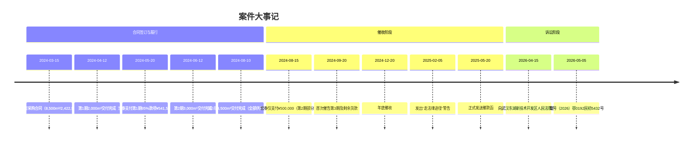
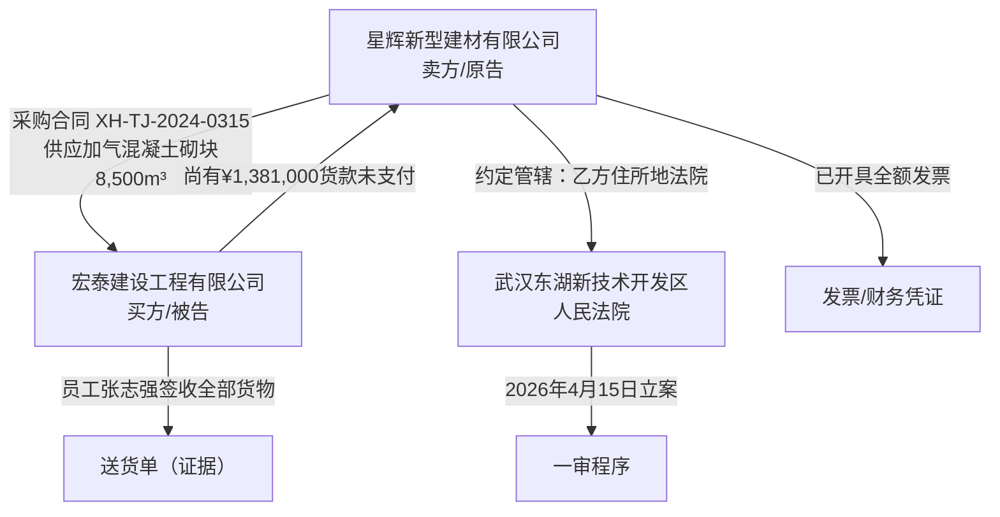
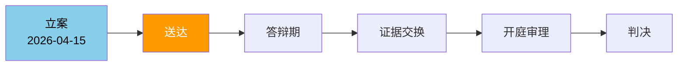
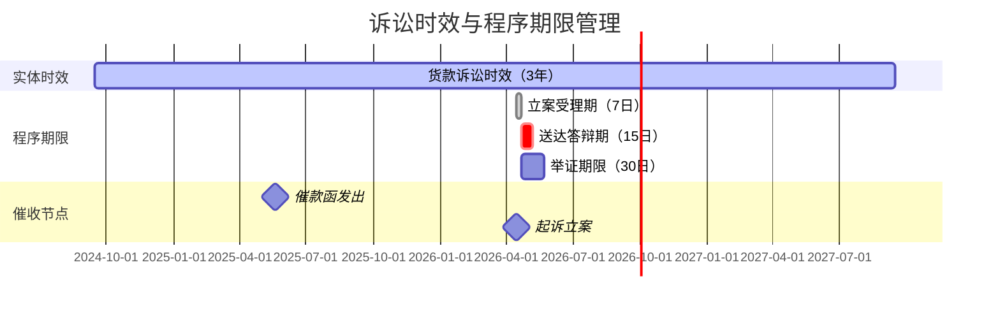

# 案件信息

> 编制日期：2026年5月5日 | 持续更新中

---

## 一、基本信息

| 项目 | 内容 |
|------|------|
| 案号 | （2026）鄂0192民初5432号 |
| 案件名称 | 星辉新型建材有限公司诉宏泰建设工程有限公司买卖合同纠纷 |
| 案由 | 买卖合同纠纷 |
| 当前诉讼阶段 | 一审 |
| 承办法院 | 武汉东湖新技术开发区人民法院 |
| 承办法官 | ⚠️ 待补充（收到传票后更新） |
| 书记员 | ⚠️ 待补充 |
| 开庭时间 | ⚠️ 待补充（收到传票后更新） |
| 立案时间 | 2026年4月15日 |
| 我方代理律师 | ⚠️ 待补充 |

---

## 二、当事人信息

| 诉讼地位 | 姓名/名称      | 身份证号/统一社会信用代码      | 住所/注册地               | 法定代表人/负责人 | 联系方式   | 代理律师   |
| ---- | ---------- | ------------------ | -------------------- | --------- | ------ | ------ |
| 原告   | 星辉新型建材有限公司 | 91420100789012345X | 武汉市东湖高新区光谷大道66号星辉产业园 | 李星辉       | ⚠️ 待补充 | ⚠️ 待补充 |
| 被告   | 宏泰建设工程有限公司 | 91420100567891234X | 武汉市洪山区珞喻路108号宏泰大厦    | 王建国       | ⚠️ 待补充 | ⚠️ 待补充 |
| 第三人  | —          | —                  | —                    | —         | —      | —      |

---

## 三、工作时间节点

| 序号  | 事项     | 截止日期       | 负责人   | 状态     | 备注  |
| --- | ------ | ---------- | ----- | ------ | --- |
| 1   | 立案     | 2026-04-15 | 杨卫薪律师 | ✅ 已完成  | 已缴费 |
| 2   | 等待法院排期 | —          | —     | 🔄 进行中 |     |
| 3   | 补充证据材料 | 开庭前7日      | 杨卫薪律师 | ⬜ 待办   |     |
| 4   | 庭审准备   | 开庭前3日      | 杨卫薪律师 | ⬜ 待办   |     |

---

## 四、案件可视化图表

### 4.1 案件时间线大事记

### 4.2 法律关系图

### 4.3 诉讼流程图及当前节点

> 🔶 橙色高亮：送达阶段（当前所处节点，等待法院排期）

### 4.4 诉讼时效期限图

---

## ⚠️ 信息空缺提示

| 缺失字段 | 影响 | 建议 |
|----------|------|------|
| 承办法官/书记员 | 无法判断是否需要申请回避 | 等待传票后补充 |
| 开庭时间 | 无法预判庭审准备节奏 | 关注12368短信或法院通知 |
| 被告代理律师 | 无法预判答辩策略 | 答辩状送达后补充 |
| 我方律师联系方式 | 纯属遗漏 | 请补充 |
