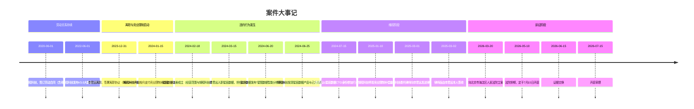
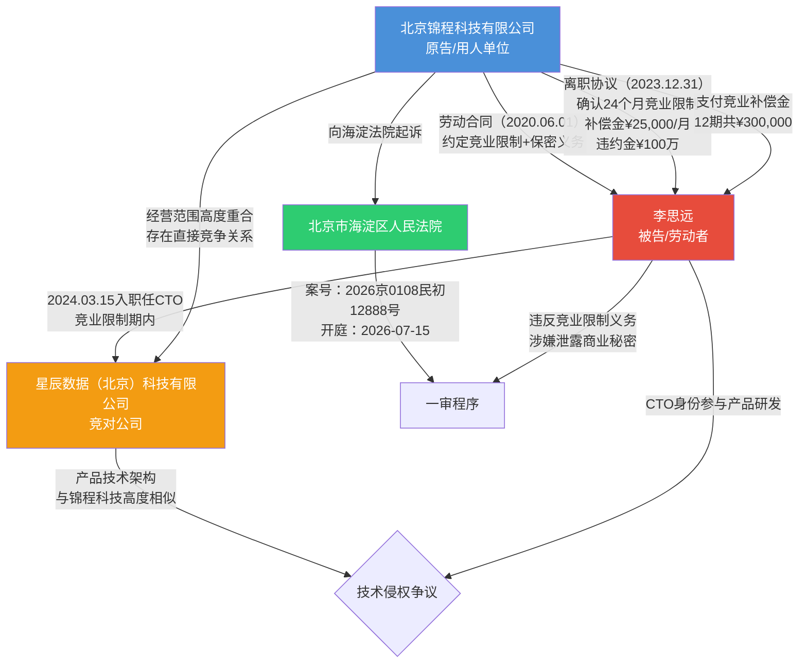
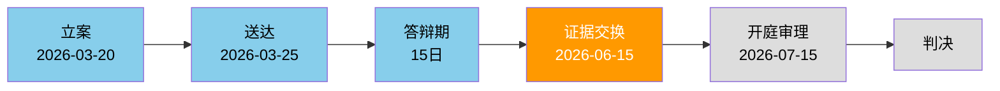
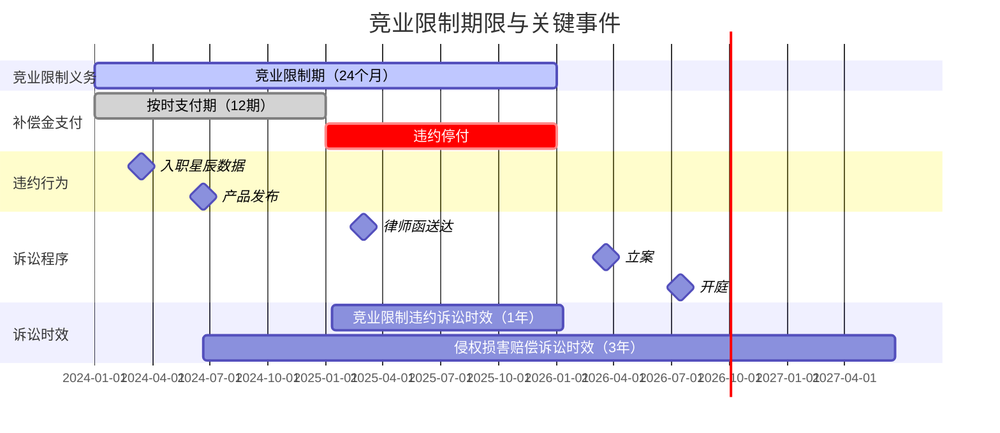
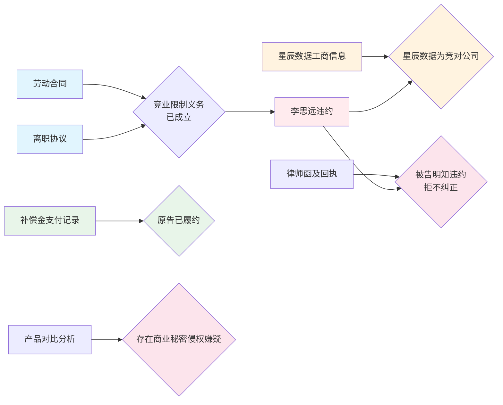

# 案件信息

> 编制日期：2026年5月5日 | 持续更新中

---

## 一、基本信息

| 项目 | 内容 |
|------|------|
| 案号 | （2026）京0108民初12888号 |
| 案件名称 | 北京锦程科技有限公司诉李思远劳动合同纠纷 |
| 案由 | 竞业限制纠纷（含商业秘密侵权损害赔偿） |
| 当前诉讼阶段 | 一审 |
| 承办法院 | 北京市海淀区人民法院 |
| 承办法官 | 张晨光 |
| 法官联系电话 | 010-62697188 |
| 书记员 | ⚠️ 待补充（收到传票后更新） |
| 开庭时间 | 2026年7月15日 |
| 立案时间 | 2026年3月20日 |
| 排期时间 | 2026年5月10日 |
| 证据交换时间 | 2026年6月15日 |
| 我方代理律师 | ⚠️ 待补充 |

---

## 二、当事人信息

| 诉讼地位 | 姓名/名称 | 身份证号/统一社会信用代码 | 住所/注册地 | 法定代表人/负责人 | 联系方式 | 代理律师 |
| ---- | ---------- | ------------------ | -------------------- | --------- | ------ | ------ |
| 原告 | 北京锦程科技有限公司 | 91110108MA00ABCDEF | 北京市海淀区中关村软件园A座15层 | 陈锦程 | 010-62697000 | ⚠️ 待补充 |
| 被告 | 李思远 | 110108199005123456 | 北京市海淀区中关村南大街12号院3号楼 | — | 138****5678 | ⚠️ 待补充 |
| 竞对公司 | 星辰数据（北京）科技有限公司 | 91110108MA00XYZ999 | 北京市海淀区上地信息路10号创新大厦B座12层 | 王星辰 | — | —（非本案当事人） |

---

## 三、工作时间节点

| 序号 | 事项 | 截止日期 | 负责人 | 状态 | 备注 |
| --- | ------ | ---------- | ----- | ------ | --- |
| 1 | 立案 | 2026-03-20 | 代理律师 | ✅ 已完成 | 案号（2026）京0108民初12888号 |
| 2 | 排期 | 2026-05-10 | 法院 | ✅ 已完成 | 确定开庭日期 |
| 3 | 证据交换 | 2026-06-15 | 代理律师 | 🔄 进行中 | 需在截止日前提交全部证据 |
| 4 | 补充证据材料 | 开庭前7日（2026-07-08前） | 代理律师 | ⬜ 待办 | 含技术鉴定报告、经济损失核算等 |
| 5 | 庭审准备 | 开庭前3日（2026-07-12前） | 代理律师 | ⬜ 待办 | 庭审提纲、质证意见、代理词 |
| 6 | 开庭审理 | 2026-07-15 | 代理律师 | ⬜ 待办 | 北京市海淀区人民法院 |

---

## 四、案件可视化图表

### 4.1 案件时间线大事记

### 4.2 法律关系图

### 4.3 诉讼流程图及当前节点

> 🔶 橙色高亮：证据交换阶段（当前所处节点，2026年6月15日进行）
> 🔷 蓝色：已完成阶段

### 4.4 竞业限制期限图

### 4.5 证据体系图

---

## ⚠️ 信息空缺提示

| 缺失字段 | 影响 | 建议 |
|----------|------|------|
| 书记员姓名 | 无法判断是否需要申请回避 | 等待传票后补充 |
| 被告代理律师 | 无法预判答辩策略 | 答辩状送达后补充 |
| 我方代理律师 | 内部信息缺失 | 请补充律师姓名及联系方式 |
| 技术鉴定报告 | 商业秘密侵权证明力不足 | 建议委托第三方鉴定机构出具技术相似度鉴定报告 |
| 经济损失核算 | 影响赔偿金额主张 | 建议由财务部门出具因违约造成的经济损失核算报告 |
| 李思远离职时签字的密级文件清单 | 确认离职时清退了哪些商业秘密载体 | 需调取离职交接记录，确认源代码等是否完整归还 |
| 星辰数据融资/估值信息 | 佐证竞业业务的实际竞争影响 | 可查询企查查/天眼查等平台 |
