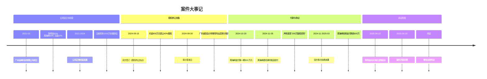
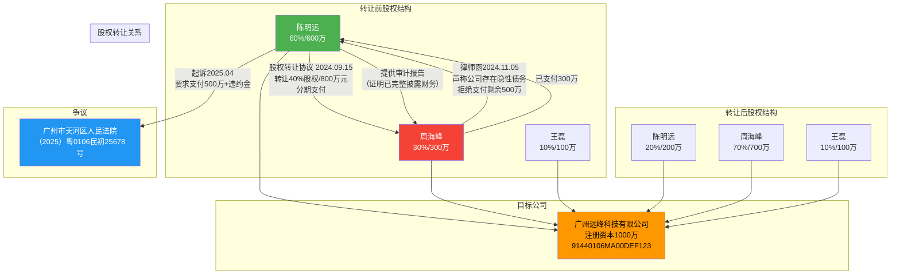
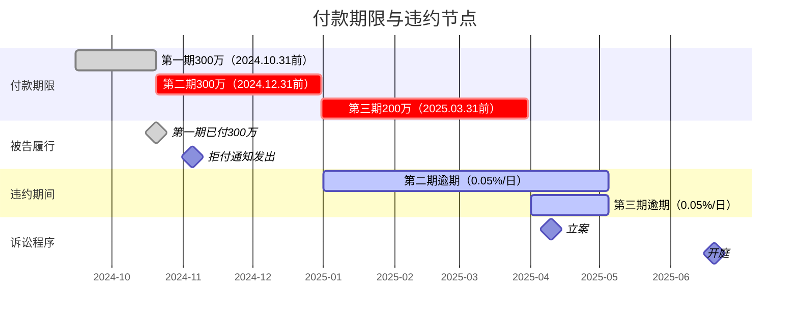

# 案件信息

> 编制日期：2025年5月5日 | 持续更新中

---

## 一、基本信息

| 项目 | 内容 |
|------|------|
| 案号 | （2025）粤0106民初25678号 |
| 案件名称 | 陈明远诉周海峰股权转让纠纷 |
| 案由 | 股权转让纠纷 |
| 当前诉讼阶段 | 一审（已开庭待判决） |
| 承办法院 | 广州市天河区人民法院 |
| 承办法官 | 林嘉慧 |
| 法官联系方式 | 020-87563666 |
| 书记员 | ⚠️ 待补充 |
| 开庭时间 | 2025年6月20日 |
| 立案时间 | 2025年4月10日 |
| 我方代理律师 | 杨卫薪律师（广东天河律师事务所） |

---

## 二、当事人信息

| 诉讼地位 | 姓名/名称 | 身份证号/统一社会信用代码 | 住所/注册地 | 法定代表人/负责人 | 联系方式 | 代理律师 |
|----------|-----------|--------------------------|-------------|-------------------|----------|----------|
| 原告 | 陈明远 | 440106197812054321 | 广州市天河区天河北路888号时代广场A座2801室 | — | 13800001111 | 杨卫薪律师 |
| 被告 | 周海峰 | 440106198203087654 | 广州市越秀区中山五路168号财富大厦B座1502室 | — | ⚠️ 待补充 |
| 目标公司 | 广州远峰科技有限公司 | 91440106MA00DEF123 | 广州市天河区黄埔大道西100号富力盈泰广场C座1106室 | 陈明远（原） | — |
| 其他股东 | 王磊 | ⚠️ 待补充 | ⚠️ 待补充 | — | — |

---

## 三、工作时间节点

| 序号 | 事项 | 截止日期 | 负责人 | 状态 | 备注 |
|------|------|----------|--------|------|------|
| 1 | 立案 | 2025-04-10 | 杨卫薪律师 | ✅ 已完成 | 案号（2025）粤0106民初25678号 |
| 2 | 证据材料收集与整理 | 2025-05-05 | 杨卫薪律师团队 | ✅ 已完成 | 含审计报告原件调取 |
| 3 | 审前程序（送达、答辩） | 2025-04-20 | 法院 | ✅ 已完成 | 被告已提交答辩状 |
| 4 | 第一次庭审 | 2025-06-20 | 杨卫薪律师 | ✅ 已完成 | 法庭调查+法庭辩论 |
| 5 | 等待判决 | 预计2025年7月 | — | 🔄 进行中 | 择期宣判 |
| 6 | 宣判后评估 | 收到判决后7日内 | 杨卫薪律师 | ⬜ 待办 | 评估是否上诉 |

---

## 四、案件可视化图表

### 4.1 案件时间线大事记

### 4.2 法律关系图

### 4.3 诉讼流程图及当前节点

```mermaid
flowchart LR
    A[公司成立<br/>2021-03] --> B[签订股权转让协议<br/>2024-09-15] --> C[第一期付款<br/>2024-10-20]
    C --> D[被告拒付<br/>2024-11-05] --> E[协商未果<br/>2024.11-2025.03]
    E --> F[立案<br/>2025-04-10] --> G[送达/答辩<br/>2025-04] --> H[开庭审理<br/>2025-06-20] --> I[等待判决<br/>当前]

    style A fill:#e0e0e0,color:#000
    style B fill:#e0e0e0,color:#000
    style C fill:#e0e0e0,color:#000
    style D fill:#e0e0e0,color:#000
    style E fill:#e0e0e0,color:#000
    style F fill:#e0e0e0,color:#000
    style G fill:#e0e0e0,color:#000
    style H fill:#e0e0e0,color:#000
    style I fill:#ff9900,color:#fff
```

> 🔶 橙色高亮：等待判决（当前所处节点）

### 4.4 付款期限与违约分析图

---

## 五、信息空缺提示

| 缺失字段 | 影响 | 建议 |
|----------|------|------|
| 王磊身份证号及联系方式 | 如需追加第三人或申请证人出庭 | 向陈明远核实，调取工商档案 |
| 被告代理律师信息 | 无法预判被告答辩策略深度 | 查阅被告答辩状后补充 |
| 判决日期 | 影响后续工作安排 | 关注法院通知，等待宣判 |
| 远峰科技2024年10月-2025年3月经营状况 | 被告可能主张股权价值已重大贬损 | 向远峰科技财务部门调取期间财报 |
| 鑫达电子供应商往来合同原件 | 核实被告声称"隐性债务"的具体情况 | 联系远峰科技财务/采购部门提供 |
| 双方2024年11月-2025年3月协商记录 | 判断是否存在诉讼时效中断、调解诚意等 | 请陈明远提供微信/邮件/会议记录 |
