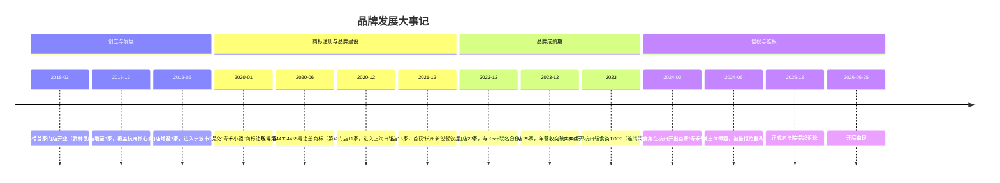
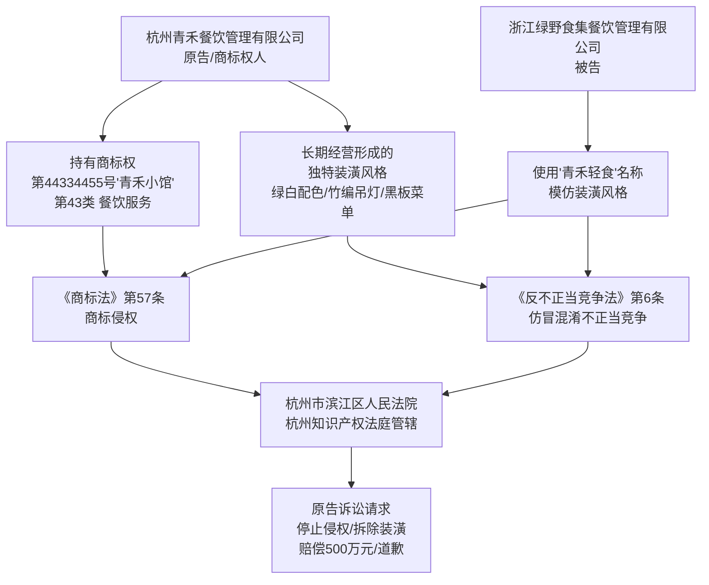
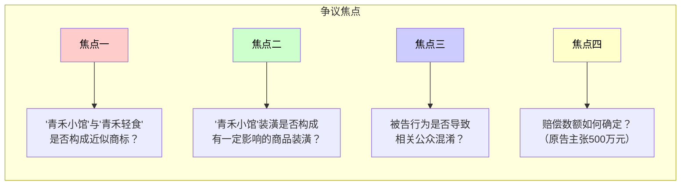
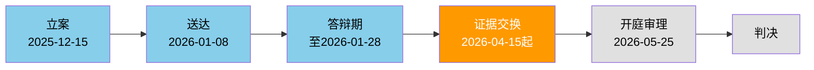
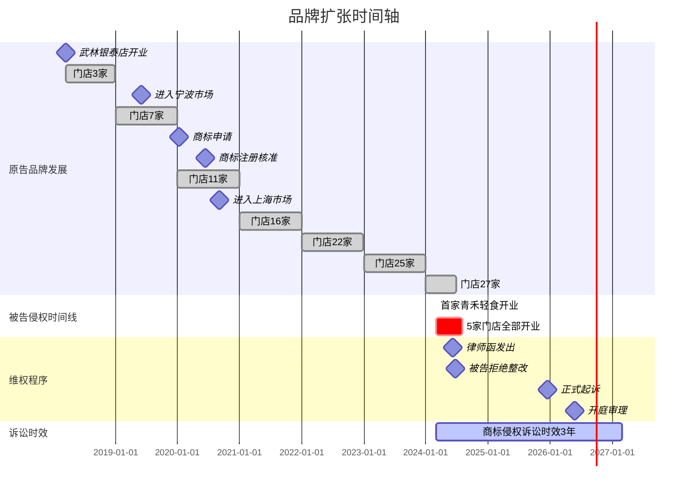

# 案件信息

> 编制日期：2026年5月5日 | 持续更新中

---

## 一、基本信息

| 项目 | 内容 |
|------|------|
| 案号 | （2026）浙0108民初22345号 |
| 案件名称 | 杭州青禾餐饮管理有限公司诉浙江绿野食集餐饮管理有限公司侵害商标权及不正当竞争纠纷 |
| 案由 | 侵害商标权及不正当竞争纠纷 |
| 当前诉讼阶段 | 一审 |
| 承办法院 | 杭州市滨江区人民法院（杭州知识产权法庭管辖） |
| 承办法官 | 陈知远 |
| 法官联系方式 | 0571-86551288 |
| 书记员 | ⚠️ 待补充 |
| 开庭时间 | 2026年5月25日 |
| 立案时间 | 2025年12月15日 |
| 排期时间 | 2026年3月20日 |
| 我方代理律师 | 杨卫薪，浙江明理律师事务所 |

---

## 二、当事人信息

| 诉讼地位 | 姓名/名称 | 统一社会信用代码 | 住所/注册地 | 法定代表人/负责人 | 联系方式 | 代理律师 |
|----------|-----------|-----------------|------------|-------------------|----------|----------|
| 原告 | 杭州青禾餐饮管理有限公司 | 91330108MA00PQR567 | 浙江省杭州市滨江区长河街道江南大道1090号 | 林雨桐 | 0571-86551288 | 杨卫薪（浙江明理律师事务所） |
| 被告 | 浙江绿野食集餐饮管理有限公司 | 91330109MA00STU890 | 浙江省杭州市萧山区钱江世纪城皓月路168号 | 周明远 | 0571-85678901 | ⚠️ 待补充 |
| 第三人 | — | — | — | — | — | — |

---

## 三、工作时间节点

| 序号 | 事项 | 截止日期 | 负责人 | 状态 | 备注 |
|------|------|----------|--------|------|------|
| 1 | 立案 | 2025-12-15 | 杨卫薪律师 | ✅ 已完成 | 已缴费，案号已分配 |
| 2 | 送达被告 | 2026-01-08 | 法院 | ✅ 已完成 | 被告已签收 |
| 3 | 被告答辩 | 2026-01-28 | 被告方 | ✅ 已完成 | 被告否认侵权 |
| 4 | 庭前证据交换 | 2026-04-15至05-20 | 杨卫薪律师 | 🔄 进行中 | 双方证据交换中 |
| 5 | 开庭审理 | 2026-05-25 | 杨卫薪律师 | ⬜ 待办 | 滨江法院知识产权庭 |
| 6 | 补充证据（如有） | 开庭前7日 | 杨卫薪律师 | ⬜ 待办 | 2026-05-18前 |

---

## 四、案件可视化图表

### 4.1 品牌发展大事记

### 4.2 法律关系图

### 4.3 主要争议焦点

### 4.4 诉讼流程图及当前节点

> 🔶 橙色高亮：庭前证据交换阶段（当前所处节点）

### 4.5 品牌扩张时间轴

---

## 五、争议焦点预判

| 序号 | 争议焦点 | 我方主张 | 对方可能抗辩 | 预判分析 |
|------|----------|----------|-------------|----------|
| 1 | "青禾小馆"与"青禾轻食"是否构成近似商标 | 核心词"青禾"完全相同，仅描述性后缀不同，足以导致混淆 | "青禾"为常见词组，显著性弱；"轻食"与"小馆"含义不同 | 我方有利——"青禾"非餐饮行业通用词，组合使用时具有显著性，且被告使用"青禾"+品类词的结构明显模仿 |
| 2 | "青禾小馆"装潢是否构成"有一定影响的商品装潢" | 绿白配色+竹编灯+黑板菜单+木桌椅的组合装潢经6年27店长期使用，已在相关公众中建立稳定对应关系 | 上述元素为轻食行业通用风格，原告无权垄断 | 我方有利——装潢元素组合具有独特性，且知名度证据充分（公证书+排名数据+媒体报道） |
| 3 | 被告行为是否导致混淆 | 公证书可证明装潢高度近似，品牌知名度可证明混淆可能性 | 被告门店标注了自身企业名称，消费者不会混淆 | 我方有利——企业名称标注不排除混淆可能性，首因效应决定是否建立错误关联 |
| 4 | 赔偿数额（500万元） | 按被告5家门店的侵权获利或法定赔偿主张 | 原告损失或被告获利证据不足 | 需进一步举证——建议申请法院责令被告提交财务账册 |

---

## ⚠️ 信息空缺提示

| 缺失字段 | 影响 | 建议 |
|----------|------|------|
| 书记员姓名 | 无法判断是否需要申请回避 | 查看传票后补充 |
| 被告代理律师信息 | 无法预判答辩策略 | 答辩状中一般会披露，收到后补充 |
| 被告5家门店营收数据 | 影响赔偿金计算（500万能否支撑） | 申请法院责令被告提交财务账册/纳税记录 |
| 消费者混淆调查报告 | 可增强混淆可能性的证明 | 建议尽快委托第三方开展消费者调查 |
| "青禾小馆"装潢设计原始方案 | 可进一步证明装潢的独创性/显著性 | 从公司档案中查找设计合同及方案稿 |
